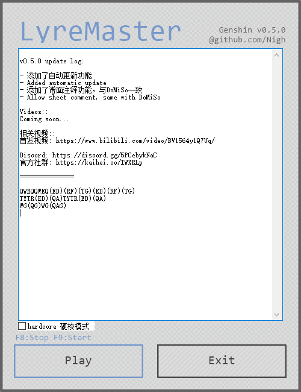
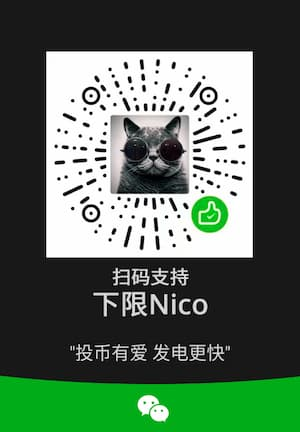

- github：https://github.com/Nigh/LyreMaster-Genshin

> This document has been mostly translated by `deepl.com`

## Introduction(简介)

`LyreMaster` is a software that helps you to play musical instruments easily in the game 「Genshin Impact」.

`手搓弹琴大师` 是一个帮助你在游戏《原神》中轻松演奏乐器的软件。

## Download(下载)

- [GitHub Download - GitHub下载](https://github.com/Nigh/LyreMaster-Genshin/releases/latest/download/LyreMaster.zip)
- [Mirror Download - 镜像下载](https://ghproxy.com/https://github.com/Nigh/LyreMaster-Genshin/releases/latest/download/LyreMaster.zip)

## Related Software(相关软件)
##### [DoMiSo-Genshin(自动弹琴人偶-原神)](https://github.com/Nigh/DoMiSo-genshin)

`DoMiSo` is a software that helps you play musical instruments fully automatically in the game 「Genshin Impact」.

`自动弹琴人偶` 是一个帮助你在游戏《原神》中全自动演奏乐器的软件。

Special Edition Statute(特别版规约)
------------------
Any derivative works created using this version of the software need to be credited in the work.
The source of the software should be properly acknowledged in the text description section.

Any infringement of third parties caused by the use of this software is the sole responsibility of the user.

任何使用本软件创作的衍生作品均需要在作品中注明。
并在文字描述部分恰当的注明软件来源。

任何由于使用本软件对第三方所造成的侵害均由使用者本人负责。

## Communities(社群)
- Discord: https://discord.gg/5PCebykNaC
- 开黑啦: https://kaihei.co/IWXRLp

## Screenshot(截图)

Instructions(使用说明)
------------------

- Paste a valid keyboard sheet in the edit box
- When `Genshin Impact` has started and you are in the music playing UI, Click `Play` or press the `F9` shortcut to start the in-game auto key mapping
- Press the `F8` shortcut key to stop the key mapping

- 在编辑框中粘贴有效的键盘谱
- 在`原神`游戏已经启动，并且在演奏界面时，点击`Play`或者按下`F9`快捷键可以开始游戏中的自动按键映射
- 按下`F8`快捷键可以停止自动映射

> As the `Genshin Impact` game is launched with administrator privileges, this software requires administrator privileges to interact with the game proper  
> 由于`原神`游戏以管理员权限启动，所以本软件需要管理员权限才能与游戏本体交互。

## AHK version

`1.1.33.7 Unicode 32bit`

[Update Log(更新日志)](changes.md)
------------------

Introduction(简介)
------------------
原神手搓版，仅有演奏原神键盘谱的功能

Grammar(语法)
------------------

A single letter is a single note, brackets enclose the chord. Half angle brackets must be used
单个字母为单音，括号括起来为和弦。必须使用半角括号，即英文括号。

功能
------------------
软件通过将用户的输入映射至谱面的按键来实现自动手搓。  
请仅在演奏界面开启映射，否则会打乱你的输入。

Donate(捐助)
------------------

- Ko-fi: https://ko-fi.com/xianii
- Paypal: https://paypal.me/xianii
- Wechat: 
- Alipay: 

## Advanced Function(进阶功能)

### Hardcore Mode(硬核模式)

**When hardcore mode is on, you need to press the same number of keys as the chord notes to trigger the play. **

**硬核模式开启时，需要按下与和弦音符相同数量的按键才能触发演奏。**

